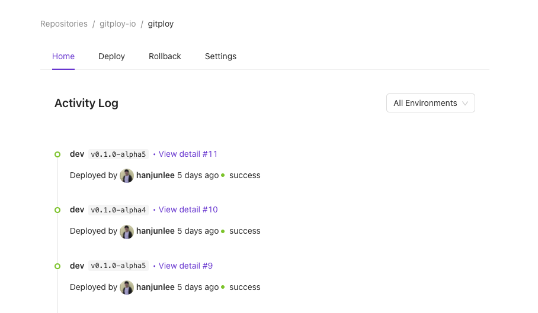

# Gitploy

## What is Gitploy?

Gitploy builds the advanced deployment pipelines around [Github Deployments API](https://docs.github.com/en/rest/reference/repos#deployments) in minutes. And also Gitploy provides advanced features, such rollback, approval, and locks.

## Docs and Support

The documentation to use Gitploy is available at: https://docs.gitploy.io

For discussions and questions, post questions or comments to our [community](https://github.com/gitploy-io/gitploy/discussions). 

For bugs or errors, [open an issue](https://github.com/gitploy-io/gitploy/issues/new/choose) with details. 

## Community 

You can visit us at Github [Discussions](https://github.com/gitploy-io/gitploy/discussions).
