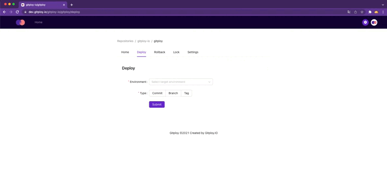

# Gitploy 

   
  
  
     
  
  
  
   
  <b>Gitploy helps your team build the deployment system around GitHub in minutes.</b> 
  <a href="https://www.gitploy.io/docs/">Documentation</a> | <a href="https://github.com/gitploy-io/gitploy/discussions">Community</a> | <a href="https://www.gitploy.io/docs/tasks/installation/">Installation Guide</a>

---

## What is Gitploy?

GitHub provides the [deployment API](https://docs.github.com/en/rest/reference/deployments#deployments) to deploy a specific ref(branch, SHA, tag). It enables your organization to build the deployment system loosely coupled tooling without worrying about the implementation details of delivering different types of applications (e.g., web, native). **But it takes a lot of resources to build the deployment system from scratch.**

Gitploy enables your organization **to build the deployment system around deployment API in minutes**, and it provides the place to manage all deployment and deploying in the same manner. 

## Features

* Manage all deployments in one place.
* Provides the intuitive UI to deploy a specific `ref` (branch, SHA, tag).
* Build an event-driven deployment system for loosely coupled tooling.
* Provides both continuous delivery and continuous deployment.
* Provides advanced deployment features: Rollback, Review, Lock, Freeze Window.
* Provides DevOps metrics.

## Gitploy vs GitHub environment

Name        | Gitploy | GitHub environment
---         |---      |---
Manual deploy                | ✅ | ✅
Auto deploy                  | ✅ | ✅
Review                       | ✅ | ✅
Rollback                     | ✅ | ❌
Deployment Safety            | ✅ | ❌
DevOps Metrics               | ✅ | ❌
Private repositories for teams plan | ✅ | ❌ 

## Getting Started

To install Gitploy on your hosting, read this [documentation](https://www.gitploy.io/docs/tasks/installation/). 

For public repositories, we're providing the [free cloud](https://cloud.gitploy.io/).

### Important Links

Documentation | Community | Installation Guide | Docker Image
--- |--- |--- |---
📚 [Documentation](https://www.gitploy.io/docs/) |❓ [Community](https://github.com/gitploy-io/gitploy/discussions) / 💬 [Slack](https://join.slack.com/t/gitploy/shared_invite/zt-112wz7qtz-HuZXMM_DaEEo1VDdsCUSRg)|📖 [Installation Guide](https://www.gitploy.io/docs/tasks/installation/) |🐋 [Docker Image](https://hub.docker.com/repository/docker/gitployio/gitploy)

## Contributors

Don't be afraid to contribute! We have many things you can do to help out. If you're trying to contribute but stuck, please tag [@hanjunlee](https://github.com/hanjunlee).

You can check the [contributing](./CONTRIBUTING.md) for exact details on how to contribute.
