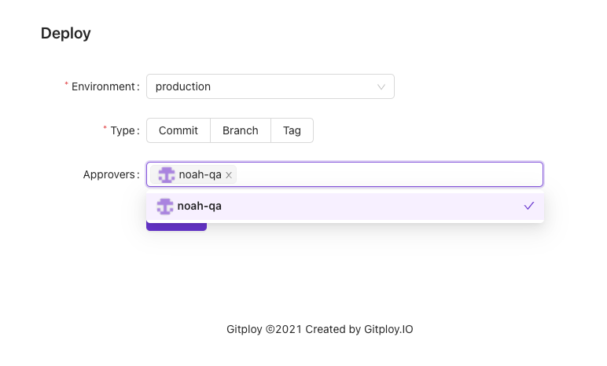

# Approval

Request approvals to commiters who has commited for the deployment. The reviewers must have at least read access to the repository. And you can configure how many reviewers needs to approve.

For more information, you can check the [document](./deploy.yml.md).

Figure) Request approval

