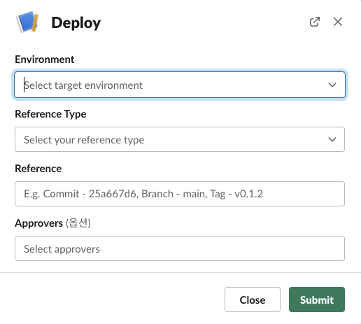

# Chatops

ChatOps is a term that’s been coined recently to refer to using chat services, such as Slack or Microsoft Teams, to deploy or run some operations. Gitploy also supports Chatops as a helper tool. 

## Integration

Currently, Gitploy supports Slack only, but it will support Microsoft Teams near the corner. 

## Limit

Cloud doesn't support Chatops. *Only self-hosted is available.* You can check [how to integrate with Chatops](../tasks/integration.md) for details.