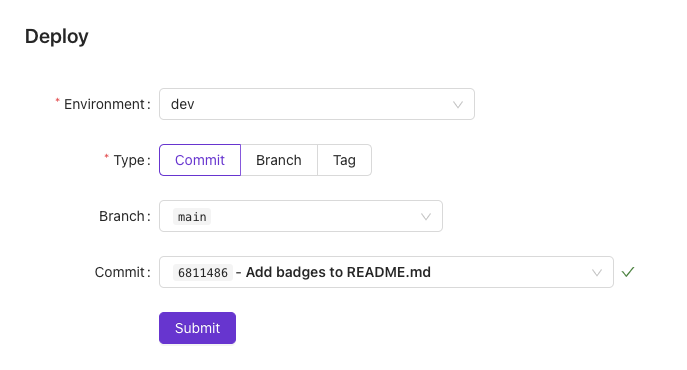
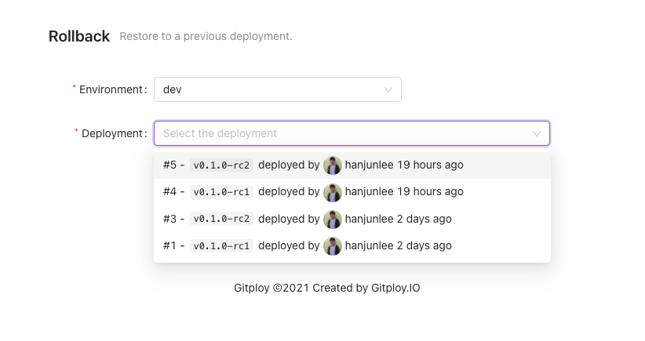

# Deployment

Gitploy provides two types of deployment: Deploy and Rollback.

## Deploy

Deploying is the primary feature of Gitploy. When you deploy, you have to select the environment and the reference. The environment is one of the environments defined in the configuration file (i.e., deploy.yml). And for reference, you can choose one of commit, branch, and tag.

When you deploy the ref, Gitploy post the deployment to GitHub, and Github dispatch the event to external services.

Figure) Deploy

## Rollback

Rollback is the best way to recover while you fix the problems, and Gitploy supports the rollback. You can choose one of the deployed references for the environment to roll back. 

When you roll back to the specific reference, Gitploy posts a new deployment with the reference from the rollbacked deployment. *Note that if the reference of the rollbacked deployment is a branch, Gitploy automatically references the commit SHA to avoid deploying the head of the branch.*

For best practice, you should lock the environment to block deploying by others until finishing to fix the problems. Gitploy provide the 'lock' feature in UI and Chatops.

Figure) Rollback

