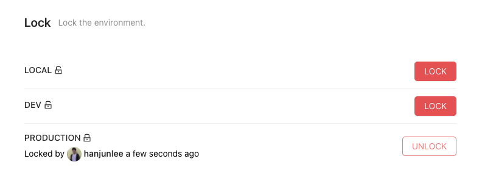

# Lock

The worst thing that can happen is someone deploys to the same repository during an incident. The lock helps with this. We provide the locking system to block deployments going out to the environment. 

You can lock the environment simply by clicking the `LOCK` button in the UI. And if you want to reserve unlock, you can configure the auto-unlock timer.

