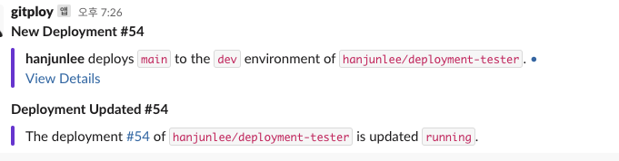

# Notification

Gitploy notifies users when deployments and reviews are created or updated. Now, Gitploy supports browser notification and Slack.

## Browser

Gitploy provides the browser notification to alert events as default. Almost modern browsers provide [notification API](https://developer.mozilla.org/ko/docs/Web/API/notification), but unfortunately, some browsers are not supported. To avoid browser compatibility, you can replace it with Slack.

*Note that if the notification doesn't work even though your browser provides it, you should check the setting that it is enabled or not.*

## Slack

Slack is a popular messaging app for businesses globally. Gitploy supports Slack to notify events of deployments and reviews. You can figure out the Connect button on the settings page after integrating with Slack. Check [the documentation](../tasks/integration.md) for details.

Figure) Slack notification

