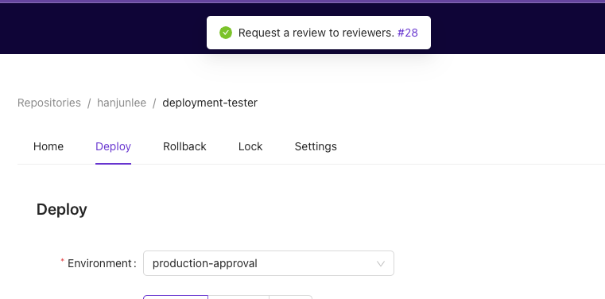
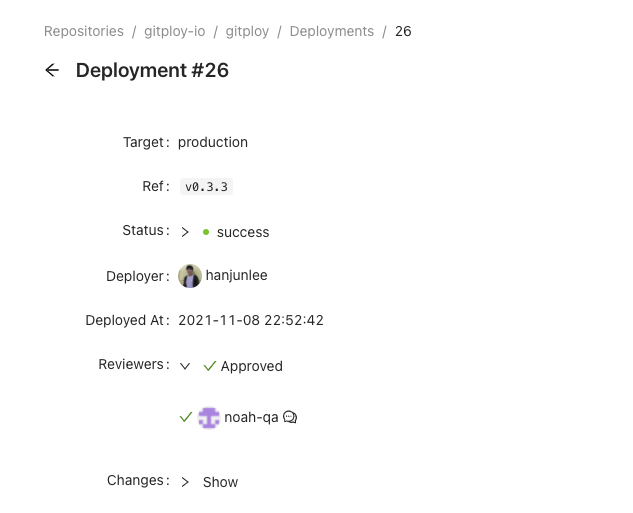

# Review

Gitploy has the review to require at least one approval for the deployment. You can list up to users on the configuration file. The reviewers must have at least read access to the repository. 

## Review process

1. First, to enable review, you must configure like the below:

```yaml
envs:
  - name: production
    auto_merge: true
    review:
      enabled: true
      reviewers: ["YOUR_LOGIN"]
```

2. When the user deploys, Gitploy request a review to reviewers.



3. After deploy, reviewers check what is changes and review the deployment. 


