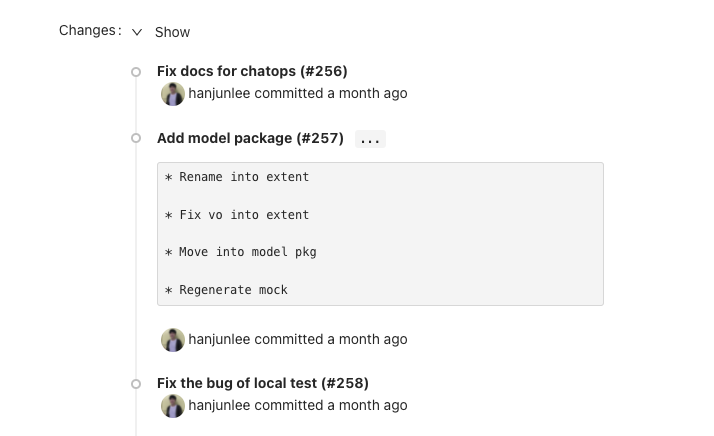

# Review

Gitploy has the review to require at least one approval for the deployment. You can list up to reviewers on the configuration file. The reviewers must be logged in and have read permission for the repository.

## Review process

1\. To enable review, you must configure the `review` field first.

```yaml
envs:
  - name: production
    review:
      enabled: true
      reviewers: ["USER_LOGIN1", "USER_LOGIN2"]
```

2\. When a user deploys in the 'deploy' tab, Gitploy automatically requests a review to reviewers. A reviewer should check what is changed from the latest one.



3\. Finally, a reviewer confirms to approve or reject the deployment, and the `deploy` button will be enabled if a reviewer approves. 

*I recommend that a reviewer use the `Approve and Deploy` to let a reviewer acknowledges that the deployment is started.*


## Notification

Gitploy notifies users when a review is requested or responded to. You can check the [documentation](./notification.md) for the detail.