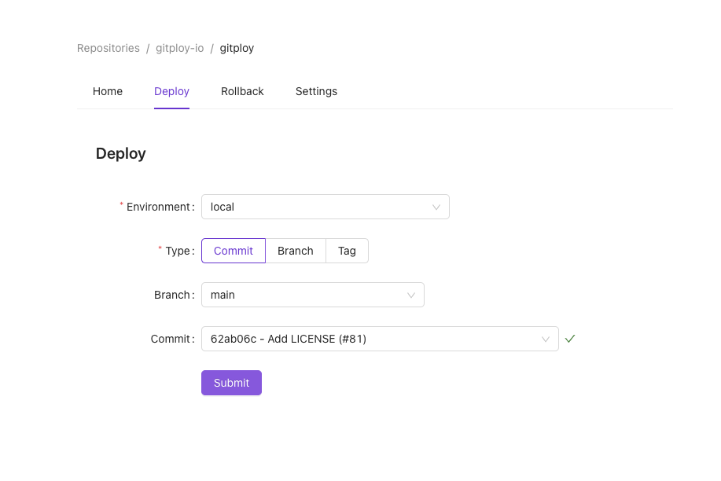
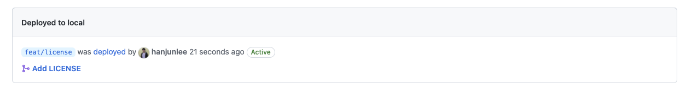

# First Deployment

On this page, we'll set up the first deployment pipeline and deploy it to the environment.

## Step 1: Push deploy.yml

To deploy Gitploy have to read the `deploy.yml` file from the default branch of the repository, so you have to create the file and commit it into the repository. In this example, we'll commit a simple `deploy.yml` file.

```yaml
# In deploy.yml
envs:
  - name: dev
    auto_merge: false
    required_contexts: []
```

```
git add .
git commit -m "Add deploy.yml"
git push
```

## Step 2: Activate Repository

After commit, you have to activate the repository in Gitploy UI.

## Step 3: Deploy 
In the 'Deploy' tab, you can find the deployment form. In this example, we'll deploy the commit:

1. Choose the environment `dev`.
2. Choose the type commit.
3. Select the commit and click the deploy button.

Figure) Gitploy Deployment Form



## Step 4: Deployment Event
On the deployment page of Github, you can find the new Github deployment at the top. In production, the deployment tool should listen to the event and start to deploy. You can reference the [community](https://github.com/gitploy-io/gitploy/discussions/categories/share-pipeline) and it is sharing how to implement the whole pipeline.

Figure) Github deployment

