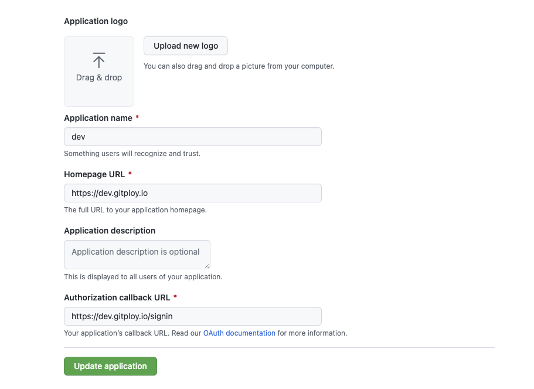

# Installation

This article explains how to install the Gitploy server for GitHub.

## Step 1: Preparation

### Provision an instance

The server should be installed on a server or virtual machine with standard http and https ports open. 

### Create an OAuth Application

[Create a GitHub OAuth application.](https://docs.github.com/en/developers/apps/building-oauth-apps/creating-an-oauth-app) The Client Key and Client Secret are used to authorize access to GitHub resources.

*The authorization callback URL must match with the format:* `GITPLOY_SERVER_PROTO://GITPLOY_SERVER_HOST/signin`.

Figure) Github OAuth



## Step 2: Configuration

The server is configured using environment variables. This article only configures with least environment. See [Configurations](../references/configurations.md) for a complete list of configuration options.

* **GITPLOY_SERVER_HOST**: 
Required string value configures the user-facing hostname. This value is used to create webhooks and redirect urls. 

* **GITPLOY_SERVER_PROTO**: 
Optional string value configures the user-facing protocol. This value is used to create webhooks and redirect urls. It can be one of them: `http` or `https`, and the default value is `https`.

* **GITPLOY_GITHUB_CLIENT_ID**:
Required string value configures the GitHub OAuth client id. This is used to authorize access to GitHub on behalf of a Gitploy user.

* **GITPLOY_GITHUB_CLIENT_SECRET**:
Required string value configures the GitHub OAuth client secret. This is used to authorize access to GitHub on behalf of a Gitploy user.

## Step 3: Start server

### Docker

The server is distributed as a Docker image. The image is self-contained and does not have any external dependencies. We recommend to use the last version.

```
docker pull gitployio/gitploy:0.3
```

The server container can be started with the below command. The container is configured through environment variables.

```shell
docker run \
  --volume=/var/lib/gitploy:/data \
  --env=GITPLOY_SERVER_HOST={{GITPLOY_SERVER_HOST}} \
  --env=GITPLOY_SERVER_PROTO={{GITPLOY_SERVER_PROTO}} \
  --env=GITPLOY_GITHUB_CLIENT_ID={{GITPLOY_GITHUB_CLIENT_ID}} \
  --env=GITPLOY_GITHUB_CLIENT_SECRET={{GITPLOY_GITHUB_CLIENT_SECRET}} \
  --publish=80:80 \
  --publish=443:443 \
  --restart=always \
  --detach=true \
  --name=gitploy \
  gitployio/gitploy:0.3
```

### Kubernetes

The server can be started in Kubernetes with the below artifacts. The container is configured through environment variables.

And we’re also support the official Helm chart to install the server, check [here](https://github.com/gitploy-io/helm-chart) for details.

<details>
<summary>Kubernetes YAML</summary>

```yaml
apiVersion: v1
kind: Service
metadata:
  name: gitploy
  labels:
    app.kubernetes.io/name: gitploy
spec:
  type: ClusterIP
  ports:
    - port: 80
      targetPort: http
      protocol: TCP
      name: http
  selector:
    app.kubernetes.io/name: gitploy
---
apiVersion: apps/v1
kind: Deployment
metadata:
  name: gitploy
  labels:
    app.kubernetes.io/name: gitploy
spec:
  replicas: 1
  selector:
    matchLabels:
      app.kubernetes.io/name: gitploy
  template:
    metadata:
      labels:
        app.kubernetes.io/name: gitploy
    spec:
      containers:
        - name: gitploy-server
          image: "gitployio/gitploy:0.3"
          imagePullPolicy: IfNotPresent
          ports:
            - name: http
              containerPort: 80
              protocol: TCP
          # Fill out values of environments
          env:
            - name: GITPLOY_SERVER_HOST
              value: ""
            - name: GITPLOY_SERVER_PROTO
              value: ""
            - name: GITPLOY_GITHUB_CLIENT_ID
              value: ""
            - name: GITPLOY_GITHUB_CLIENT_SECRET
              value: ""
```
</details>

## Pro tips

### Persistence

Gitploy uses an embedded SQLite database by default, and it stores all of the data in a single file. For persistence, you have to attach the volume to the path of the database (i.e., [GITPLOY_STORE_SOURCE](../references/GITPLOY_STORE_SOURCE.md)) in the container. You can check the [example](https://docs.docker.com/get-started/05_persisting_data/#persist-the-todo-data) on how to mount the volume in Docker.

And if you need alternative database, MySQL and Postgres, you should check the [database](database.md) documentation.

### Security 

The server receives the webhook through the internet, and it could be a security issue. So you probably want to limit requests to those coming from GitHub. To ensure your server is only receiving the expected GitHub request, you must configure the secret token. You can configure it by [GITPLOY_WEBHOOK_SECRET](../references/GITPLOY_WEBHOOK_SECRET.md).
