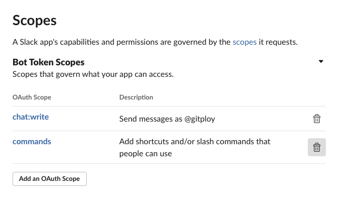
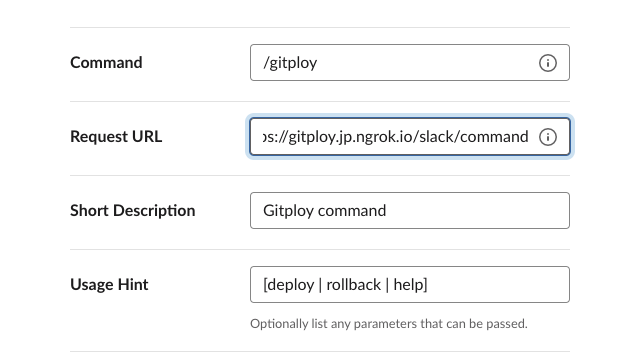
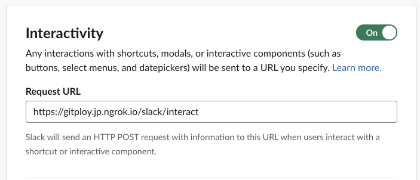

# Integration

## GitHub Action

GitHub Actions help you automate tasks to run an actual deployment. GitHub Actions are event-driven, meaning that you can run a series of commands after a deployment event has occurred. 

To listening the deployment event, you must specify `deployment` for the `on` field. And you can use the `if` conditional to run a job for the specific environment. Here is the example below.

```yaml
# Listening the deployment event
on:
  deployment

jobs:
  deploy-dev:
    runs-on: ubuntu-latest
    # Run a job when the environment is 'production.
    if: ${{ github.event.deployment.environment == 'production' }}
    steps:
      -
        name: Checkout
        uses: actions/checkout@v2
      - 
        name: Start to deploy
        uses: chrnorm/deployment-status@releases/v1
        with:
          deployment_id: ${{ github.event.deployment.id }}
          description: Start to deploy ...
          state: "in_progress"
          token: "${{ github.token }}"
    # Run your deployment commands.
```

## Slack

Slack integration provides Chatops (i.e. deploy, rollback) and notification alert for events.

### Step 1: Create App

Firstly, we have to create [Slack App](https://api.slack.com/apps). Let’s click the Create App button and fill out inputs.

### Step 2: Configure Permissions

After creating App let’s move to the *OAuth & Permissions* page. On this page, we have to set up *the redirect URLs* and *Bot Token scopes*. Firstly, let’s add a new redirect URL with the `GITPLOY_SERVER_PROTO://GITPLOY_SERVER_HOST/slack/signin` format; secondly, add `chat:write` and `commands` scopes into the Bot Token scopes.

Figure) Slack Bot Token Scopes



### Step 3: Create Slash Command

To use the slash command, we have to create a new command, `/gitploy`.  Move to the *Slash Commands* page, and fill out the "Create New Command" form like the following: 

* Command: `/gitploy`
* Request URL: `GITPLOY_SERVER_PROTO://GITPLOY_SERVER_HOST/slack/command`
* Short Description: `Gitploy command`
* Use Hint: `[deploy | rollback | help]`

Figure) Slack Create New Command



### Step 4: Configure Interactivity

To enable the interactivity, we have to configure which URL interact with Slack. Move to the *Interactivity & Shortcuts* page, and fill out the "Request URL" with the `GITPLOY_SERVER_PROTO://GITPLOY_SERVER_HOST/slack/interact`

Figure) Slack Interactivity



### Step 5: Run Server With App Credentials

To enable Slack integration, you have to set up these environments when you run the server: `GITPLOY_SLACK_CLIENT_ID`, `GITPLOY_SLACK_CLIENT_SECRET`, and `GITPLOY_SLACK_SIGNING_SECRET`. You can get these credentials from *App Credentials* section of *Basic Information* page. 

On settings page, you can find the button to connect with Slack. Now, you can run the slash command `/gitploy` in Slack.

